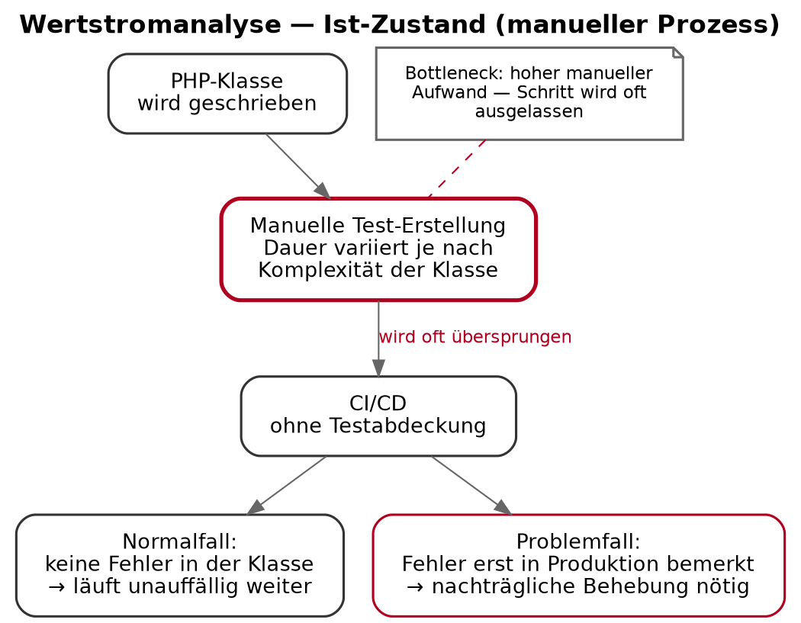
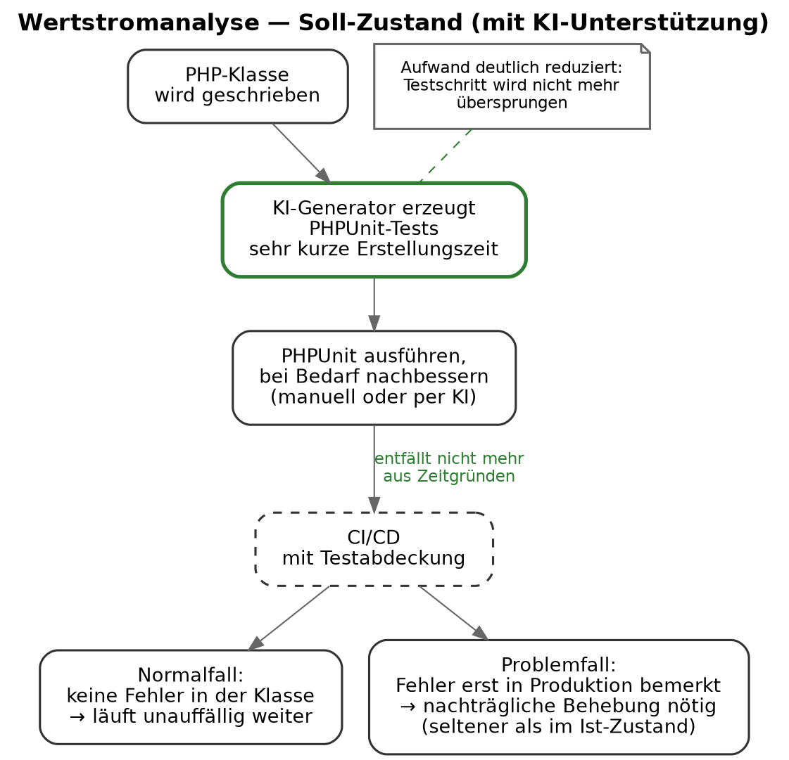
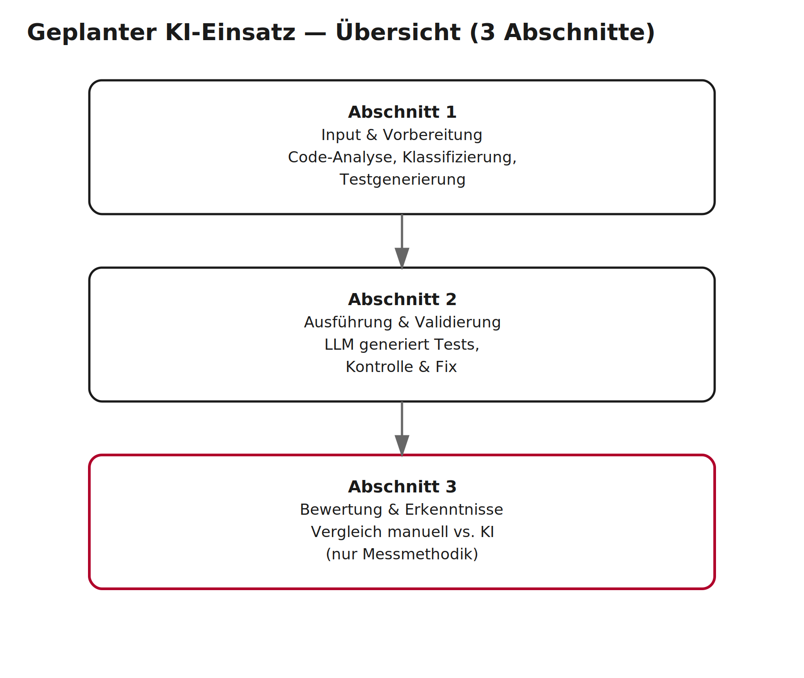
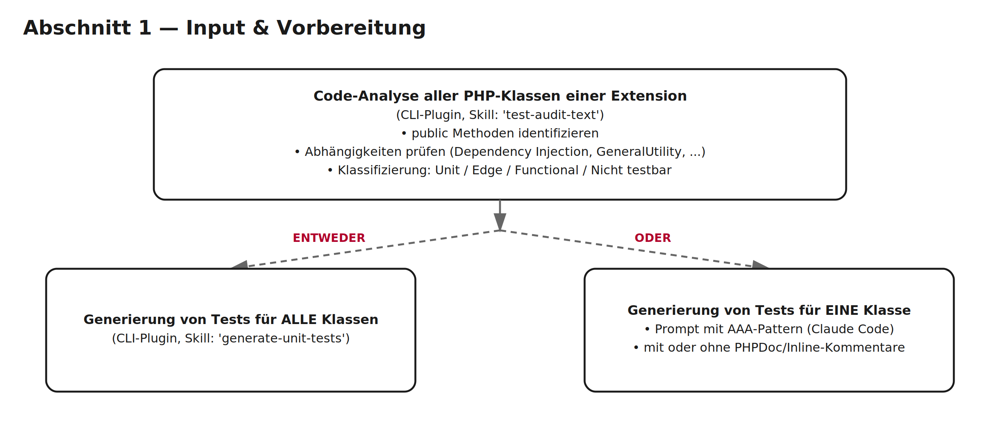
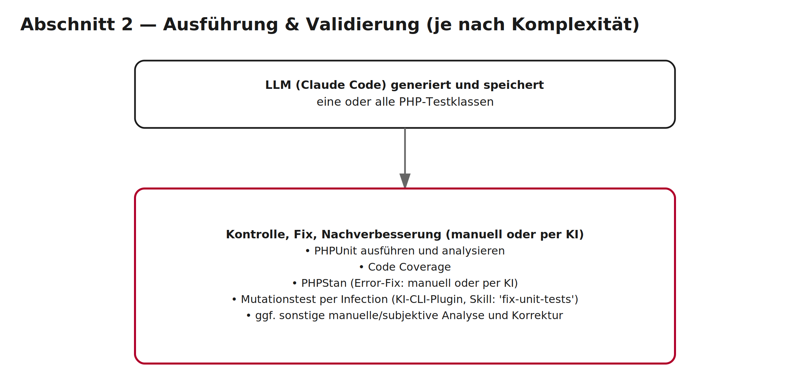
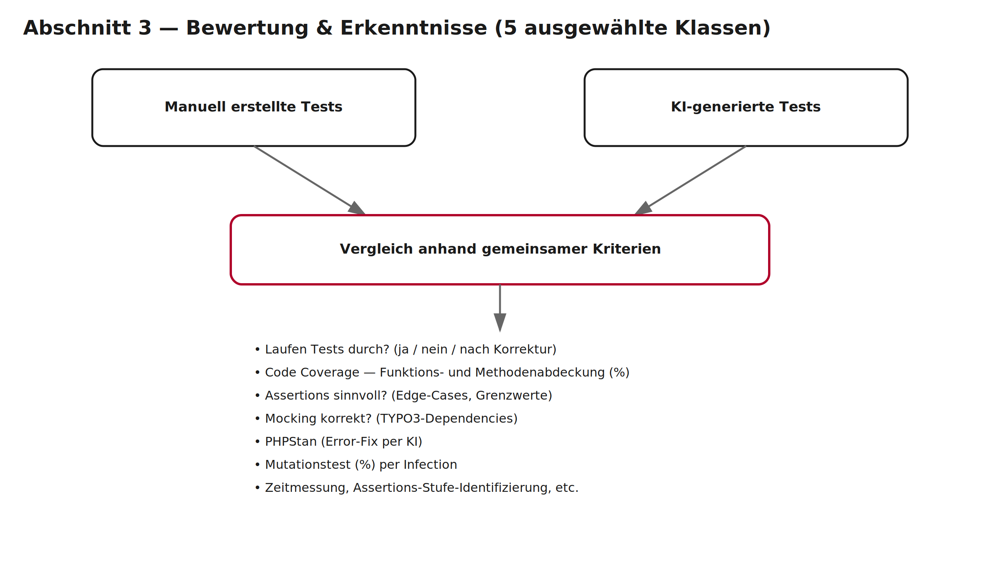
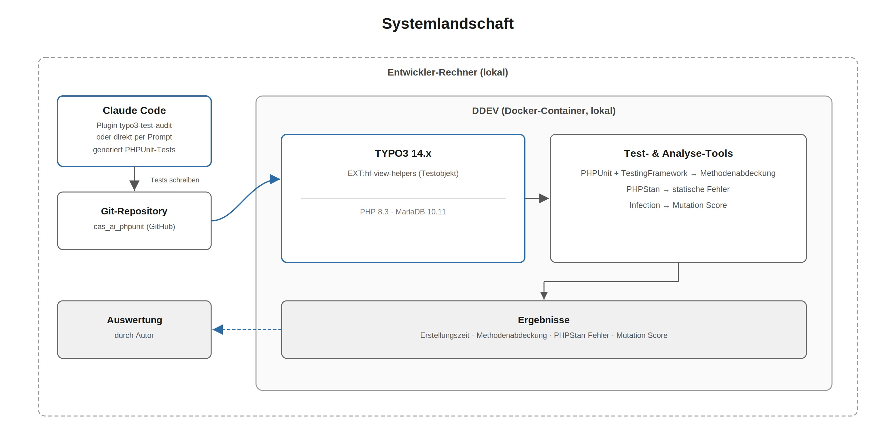
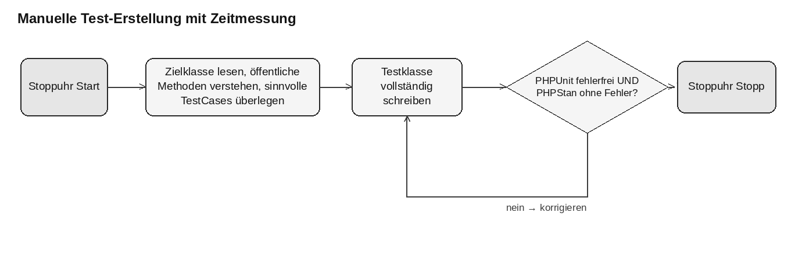
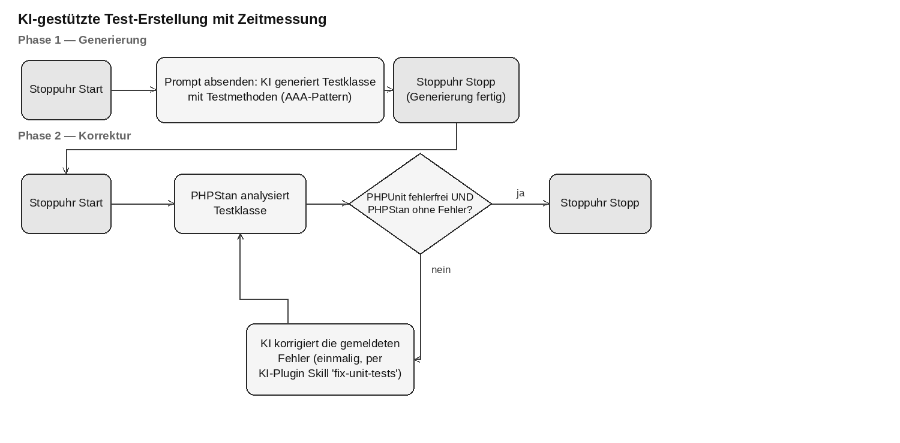
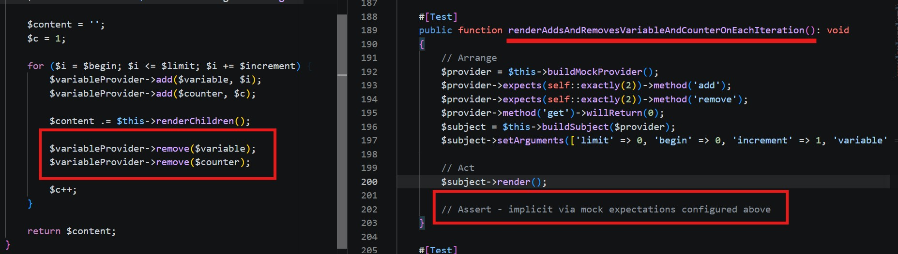

# KI PHPUnit Test Generator
## Automatische Generierung von PHPUnit-Tests unter TYPO3-Infrastruktur

**Autor:** Sinian Zhang
**CAS:** AI for Software Engineering, FHNW
**Datum:** August 2026

---

## Titelblatt

| | |
|---|---|
| **Titel** | KI PHPUnit Test Generator |
| **Untertitel** | Automatische Generierung von PHPUnit-Tests unter TYPO3-Infrastruktur |
| **Autor** | Sinian Zhang |
| **Studiengang** | CAS AI for Software Engineering, FHNW |
| **Abgabe** | August 2026 |
| **Betreuung** | [Name Dozent/in] |

---

## Kurz- und Zusammenfassung

Automatisierte Tests sind wichtig für gute Software. Im TYPO3-Alltag fehlt dafür aber oft die Zeit. Diese Arbeit prüft, ob eine KI (Claude, Modell Sonnet 5) dieses Problem lösen kann. Die KI soll aus fertigem PHP-Code selbständig gute PHPUnit-Tests schreiben — bewusst ohne Hilfe durch Kommentare im Code als Hinweis zum TestCase, damit man sieht, was die KI allein leistet.

Als Testobjekt für die vorliegende CAS-Arbeit wird die TYPO3-Extension 'hf-view-helpers' ausgewählt. Für Testausführung, statische Analyse, etc. kommen etablierte Werkzeuge zum Einsatz — PHPUnit, PHPStan und Infection. Der eigene Beitrag dieser Arbeit liegt deshalb im Vergleichsaufbau selbst sowie im dafür entwickelten CLI-Plugin 'typo3-test-audit' für Claude Code, das den Prozess strukturiert: Es identifiziert testbare Klassen, generiert die Tests und verbessert sie anhand der Mutationstest-Resultate.

Die eigentliche Validierung besteht aus einem kontrollierten Vergleich: Für fünf gezielt ausgewählte Klassen — von einfach bis TYPO3-abhängig — wird je ein von Hand geschriebener Test einem KI-generierten Test gegenübergestellt. Gemessen wird es: ob die Tests durchlaufen und wie lange die Erstellung dauert (Zeit), ob sie den Code sinnvoll abdecken (Methods Coverage), ob sie sauber und statisch fehlerfrei sind (PHPStan-Fehler), und ob sie echte Fehler erkennen statt nur oberflächlich zu bestehen (Mutation Score, gemessen mit Infection).

Die KI war immer viel schneller als von Hand. Nach kurzer Korrektur erreichten alle KI-Tests 100% Methods Coverage, keine PHPStan-Fehler und 100% Mutation Score. Beim ersten Versuch gab es aber bei drei von fünf Klassen noch Fehler oder Lücken. Deshalb darf man KI-Tests nie einfach ungeprüft übernehmen — Kontrolle durch Menschen und Mutationstests bleiben wichtig.

Die Arbeit zeigt: KI-gestützte PHPUnit-Tests funktionieren unter TYPO3(Version 14) und sparen viel Zeit, ohne die Qualität zu senken. Zusätzlich entsteht mit 'typo3-test-audit' ein Werkzeug, das auch für andere TYPO3-Extensions nutzbar ist. Empfehlung für den Arbeitgeber: einfache PHP-Klassen zuerst per KI testen lassen, die Korrektur fest einplanen, und Mutationstests dauerhaft neben PHPUnit und PHPStan einsetzen.

---

## 1. Einleitung

Dieses Kapitel führt in die Arbeit ein: Zunächst wird das Praxisproblem beschrieben, das die Motivation liefert (1.1), danach der Rahmen beim Arbeitgeber und im Demoprojekt (1.2). Anschliessend werden die Ziele auf Unternehmens-, Lern- und Projektebene erläutert (1.3), gefolgt von den beteiligten Stakeholdern und ihrem Einfluss auf die Arbeit (1.4).

### 1.1 Problembeschreibung

Automatisierte Tests gelten als Grundpfeiler moderner Softwareentwicklung. Softwaretests zählen zu den teuersten Entwicklungsphasen und können bis zu 50% der gesamten Entwicklungskosten beanspruchen (Harrold 2000, Bath und van Veenendaal 2014). Gerade in kleinen Unternehmen — zu denen auch typische TYPO3-Agenturen zählen — bleibt der Automatisierungsgrad beim Testen deshalb gering, weil Zeit- und Ressourcenknappheit den Testaufwand direkt limitieren (Felderer und Ramler 2016).  

Das Testing an sich via CI/CD-Automatisierung, die verbereitet im Einsatz ist, alleine senkt nicht den Aufwand (Felderer und Ramler 2016). Also CI/CD-Automatisierung setzt voraus, dass Tests bereits existieren, und löst damit nicht das eigentliche Nadelöhr — das Schreiben der Tests selbst. 

Genau dieses Spannungsfeld zwischen begrenzter Zeit und hohem Testaufwand bildet den Ausgangspunkt der vorliegenden Arbeit. LLMs können PHP-Code analysieren und daraus Testcode generieren. Die zentrale Frage ist: Sind diese Tests praxistauglich, sind die generierten PHPUnit-Tests von guter Qualität, also laufen sie durch, decken sie den Code sinnvoll ab, und erkennen sie echte Grenzwerte?

Untersucht wird dies anhand von fünf Klassen aus einer produktiven TYPO3-Extension 'hf-view-helpers', die in vielen Kundenprojekten benutzt wird. Die Klassen sind bewusst unterschiedlich gewählt — von einfacher Dummy-Logik über reine PHP-Logik bis hin zu komplexem TYPO3-abhängigem Code mit echtem Mocking-Bedarf. Die Ergebnisse werden quantitativ anhand von vier Kennzahlen gemessen: Erstellungszeit, Methodenabdeckung, PHPStan-Fehler und Mutation Score. Diese bilden zusammen die Grundlage für eine Einschätzung des Praxisnutzens KI-gestützter Testgenerierung.

Noch wichtig zu erwähnen: PHP-Klassen enthalten oft mehr Information als nur den ausführbaren Code — zum Beispiel in PHPDoc- oder Inline-Kommentaren, die erklären, welche Werte eine Methode erwartet, was sie zurückgibt und warum sie so implementiert wurde. In dieser Arbeit werden Tests bewusst ohne solche Kommentare als zusätzliche Inputs oder Hinweis generiert, was zeigt, was das LLM allein aus dem Quellcode ableiten kann.

Zugleich ist mir die Arbeit eine Gelegenheit, sich intensiv mit einem modernen Toolset
auseinanderzusetzen, vor allem: 
Claude Code — KI-gestützte Coding-Umgebung (Anthropic), hier als Visual-Studio-Code-Erweiterung innerhalb der IDE eingesetzt zur automatisierten Testgenerierung sowie zur Behebung von Fehlern.
PHPUnit mit dem TYPO3 Testing Framework — Weit verbreitetes Standard-Testframework für PHP zur Erstellung und Ausführung von Unit- und funktionalen Tests, im vorliegenden Projekt erweitert um TYPO3-spezifische Hilfsfunktionen und Basisklassen (z. B. UnitTestCase).
Infection für Mutationstests — Bibliothek für PHP. Verändert gezielt den Quellcode (Mutanten) und prüft anhand des Coverage-Reports, ob die bestehenden Tests diese Fehler erkennen ("töten"); das Ergebnis wird als Mutation Score ausgedrückt und zeigt so die tatsächliche Aussagekraft der Tests, nicht nur deren Abdeckung.
PHPStan für die statische Analyse — Statisches Analyse-Tool für PHP. Findet Typ- und Codefehler, ohne den Code auszuführen.

### 1.2 Organisatorische Einbettung

#### Unternehmenskontext
Aus meiner langjährigen Erfahrung in verschiedenen Webagenturen mit TYPO3-Projekten zeigt sich: In der Praxis werden sie haufig weggelassen — nicht weil Entwicklerinnen und Entwickler ihren Nutzen nicht kennen, sondern weil der Aufwand im Projektalltag mit engem Zeitbudget oft zu hoch ist.

Die vorliegende Arbeit entsteht im Rahmen meiner beruflichen Tätigkeit beim ehemaligen Arbeitgeber Hausformat GmbH, einer Agentur mit Fokus auf TYPO3-Webentwicklung. Den direkten Anlass für diese Arbeit liefert eine konkrete Aufgabe: Für die Extension 'hf-view-helpers' sollte eine PHPUnit-Testumgebung aufgesetzt und nachträglich für einige wichtige und exemplarische Klassen Unit-Tests geschrieben werden. 

Die Extension hat viele Versionen, die betroffene ist eine Version mit der aktuellen TYPO3-Version 14 kompatibel ist. Diese Arbeit setzt genau an diesem Punkt an: Sie untersucht, ob ein LLM diesen Aufwand so weit reduzieren kann, dass Unit-Tests zum Standardbestandteil jedes Entwicklungszyklus werden und ob dabei eine ausreichende Testqualität erreicht wird.

#### Projektkontext und Demo-Extension

Als technische Basis dient das TYPO3-Demoprojekt 'cas_ai_phpunit', das lokal mit DDEV (Docker-basierte Entwicklungsumgebung) betrieben wird. Innerhalb dieses Projekts wird die Extension 'hf-view-helpers' als Testgegenstand verwendet. Sie bündelt fast 50 TYPO3 Fluid-ViewHelper-Klassen, die im Produktivbetrieb eingesetzt werden. 

Um die Testbarkeit der Klassen systematisch zu erfassen, wurde im Rahmen dieser Arbeit ein eigenes Claude-Code LCI-Plugin entwickelt: 'typo3-test-audit'. Es enthält vier Skills, darunter der wichtigste Skill 'test-audit-text', der als Grundlage für die Auswahl von 5 Klassen im Rahmen der CAS-Arbeit dient: Er analysiert alle PHP-Klassen einer Extension und erstellt einen Überblick, wie viele Klassen existieren, welche sich für PHPUnit-Unit-Tests eignen und welche funktionale Tests erfordern — jeweils mit kurzer Begründung.

Die Auswahl der fünf Beispielklassen für diese Arbeit basiert auf diesem Audit-Report. Das CLI-Plugin ist nicht projektspezifisch und kann künftig bei beliebigen TYPO3-Projekten wiederverwendet werden — ein zusätzlicher Mehrwert/Benifit dieser Arbeit. Die Funktionsweise des CLI-Plugins wird in Abschnitt 3.2 und 3.3 erläutert.


### 1.3 KI-bezogene Unternehmens-, Lern-, und Projektziele

Die Ziele dieser Arbeit lassen sich auf drei Ebenen betrachten.
**Unternehmensziele (für ehemaligen auch zukünftigen Arbeitgeber)**
Im Vordergrund steht, dass automatisierte Tests im Alltag tatsächlich geschrieben werden. Wie in Abschnitt 1.1 beschrieben, fehlt im Projektgeschäft schlicht die Zeit dafür. Dass dies kein Einzelproblem meines (ehemaligen) Arbeitgebers ist, sondern ein branchenweit dokumentiertes Muster ist, zeigt die systematische Literaturübersicht von Wiklund et al. (2017). Das Praxisproblem lässt sich also verallgemeinern. Eine KI-gestützte Lösung wäre somit auch über den eigenen Arbeitgeber hinaus relevant.

Das Unternehmen erhofft sich von dieser Arbeit zwei konkrete, messbare Verbesserungen für die Test-Erstellung, gemessen anhand der in Abschnitt 2.3/3.5 definierten Kennzahlen:

Weniger Aufwand — Ist: Für die betrachteten Klassen der Extension 'hf-view-helpers' existieren aktuell keine Unit-Tests, wie genannt, aus z.B. Zeitgründen. Soll: Ein grosser Teil der Testerstellung wird durch KI übernommen (mit oder ohne Inline-Kommentar zur Generierung bestimmter TestCases), sodass die Erstellungszeit pro Klasse deutlich sinkt. Der konkrete Zielwert für die Zeitersparnis wird in Abschnitt 3.5 festgelegt (siehe Hypothese H1).

Weniger Fehler — Ist: Die Qualität von Unit-Tests wird heute nicht systematisch geprüft, es gibt weder statische Analyse noch Mutationstests. Soll: KI-generierte Tests sind statisch fehlerfrei (0 PHPStan-Fehler) und erreichen einen hohen Mutation Score. Die konkreten Schwellenwerte werden in Abschnitt 3.5 festgelegt (siehe Hypothesen H2, H7).

**persönliche Lernziele**
Neben den beiden inhaltlichen Zielen ist die Arbeit auch für Entwickler mit wenig Testing-Erfahrung von persönlichem Wert. PHPUnit-Tests sind für viele Entwickler bislang kaum Teil des Alltags — genau das macht diese Arbeit zu einer guten Gelegenheit, sich intensiv und strukturiert mit dem Thema Testing auseinanderzusetzen: Wie schreibt man sinnvolle Testfälle, wie funktioniert Mocking von TYPO3-Abhängigkeiten, wie liest man einen Coverage-Report richtig, und was sagt ein Mutation Score tatsächlich aus? Gleichzeitig lernt man den Umgang mit einem modernen Toolset — insbesondere Claude Code als KI-gestützte Entwicklungsumgebung, PHPStan für die statische Analyse und Infection für Mutationstests. Dieses Wissen bleibt auch über die Arbeit hinaus nutzbar, sowohl persönlich als auch für den Einsatz beim Arbeitgeber.

**Projektziele (CAS-Arbeit)**
Für die Arbeit selbst verfolge ich drei Hauptziele, die auch die Struktur der Auswertung in Kapitel 3 und 4 bestimmen:

Erstes Hauptziel — Ein wiederverwendbares Werkzeug: Das im Rahmen dieser Arbeit entwickelte Plugin typo3-test-audit (siehe Abschnitt 1.2 und 3.1) soll nicht nur für diese Arbeit, sondern auch danach im Tagesgeschäft nutzbar sein — für beliebige TYPO3-Extension, nicht nur für hf-view-helpers.

Zweites Hauptziel — Machbarkeit zeigen: Nachgewiesen werden soll, dass sich aus einer bestehenden PHP-Klasse mithilfe eines LLM automatisch eine lauffähige PHPUnit-Testklasse erzeugen lässt, ohne dass die Tests von Grund auf manuell geschrieben werden müssen. „Lauffähig" heisst hier ganz konkret: Die Tests lassen sich mit PHPUnit ausführen, sie bestehen (grün) und sie prüfen sinnvolle Fälle statt nur oberflächlich zu bestehen.

Drittes Hauptziel — Fairer Vergleich mit Zahlen: Die Behauptung, dass KI-generierte Tests gut sind, soll nicht nur aufgestellt, sondern mit Zahlen belegt werden. Dazu werden für jede der fünf ausgewählten Klassen die manuell geschriebenen Tests den KI-generierten Tests gegenübergestellt, anhand von vier klar messbaren Kriterien:
Erstellungszeit — wie lange dauert es, bis eine lauffähige, fehlerfreie Testklasse vorliegt?Methodenabdeckung (Coverage) — wie viele der öffentlichen Methoden werden überhaupt von einem Test aufgerufen?
PHPStan-Fehler — wie sauber und statisch fehlerfrei ist der generierte Testcode?
Mutation Score — prüfen die Tests wirklich die Logik, oder würden sie auch bei einer fehlerhaften Implementierung noch grün bleiben?


### 1.4 Stakeholder-Analyse

An dieser Arbeit sind mehrere Parteien beteiligt oder zumindest indirekt betroffen, auch wenn nicht alle aktiv mitarbeiten. Die folgende Übersicht beschreibt für jede Partei, welches Interesse sie an der Arbeit hat und wie stark sie mitbestimmen kann, wie die Arbeit abläuft und welche Richtung sie nimmt.

Entwickler mit wenig Testing-Wissen — Einfluss: hoch Der Entwickler erstellt die Tests und prüft die KI-Ergebnisse; im Fall dieser Arbeit ist das gleichzeitig der Autor. Er verfolgt zwei Ziele: Erstens will er im Projektalltag Zeit sparen, indem ein grosser Teil der Testerstellung automatisch läuft. Zweitens baut er im Rahmen des CAS solides Wissen zu PHPUnit-Testing sowie einigen Tools auf (siehe Lernziel in Abschnitt 1.3). Weil er sowohl die Methodik festlegt als auch die Messungen selbst durchführt, hat er den grössten Einfluss auf die Arbeit.

Ehemaliger oder zukünftiger Arbeitgeber — Einfluss: mittel Die Firma profitiert wirtschaftlich von besserer Code-Qualität. Der Arbeitgeber hat den ursprünglichen Anlass für das Thema geliefert (siehe Abschnitt 1.2) und liefert mit dem Demoprojekt den fachlichen Rahmen, mischt sich aber nicht in die wissenschaftliche Methodik oder einzelne Entscheidungen der Arbeit ein. Auch für einen zukünftigen Arbeitgeber ist die Arbeit relevant: Sowohl das Plugin typo3-test-audit als auch das dabei aufgebaute Fachwissen zu KI-gestützter Testgenerierung lassen sich in künftigen Projekten wiederverwenden.

TYPO3-Community — Einfluss: niedrig für die breitere TYPO3-Community ist die Arbeit interessant. Da das Plugin typo3-test-audit wiederverwendbar ist (siehe Abschnitt 1.2), könnten die Ergebnisse auch anderen TYPO3-Entwicklerinnen und -Entwicklern nützen. Die Community ist aber nicht aktiv an der Arbeit beteiligt und hat deshalb keinen direkten Einfluss auf deren Verlauf.


---

## 2. Planung

Dieses Kapitel zeigt, wie die Arbeit geplant wurde. Zuerst zeigt die Wertstromanalyse den Ist-Zustand ohne KI und den Soll-Zustand mit KI-gestützter Testgenerierung (2.1). Danach wird der geplante KI-Einsatz als konkreter Ablauf vorgestellt (2.2), gefolgt von den Hypothesen und erwarteten Benefits (2.3) sowie der Auswahl der fünf Beispielklassen und dem Vorgehen zur Einführung und Validierung (2.4). Zum Schluss als Teil der Planung werden bekannte Chancen und Risiken aus Praxis und Forschung betrachtet (2.5).

### 2.1 Wertstromanalyse

Die Wertstromanalyse (Value Stream Mapping, s. A. Davis & R. Edwards 2024) ist eine aus dem Lean Management stammende Methode, die den gesamten Arbeitsfluss „von der Idee bis in Produktion" visualisiert und dabei Engpässe (Bottlenecks) sowie Wartezeiten zwischen einzelnen Prozessschritten sichtbar macht (dora.dev/guides/value-stream-management/). Im Kontext dieser Arbeit wird der Wertstrom auf den relevanten Ausschnitt eingegrenzt: von der fertig geschriebenen PHP-Klasse bis zur produktiv nutzbaren Testabdeckung.

**Ist-Zustand (aktueller Prozess):**

Sobald eine PHP-Klasse fertig geschrieben ist, müsste als nächster Schritt die passende Testklasse manuell erstellt werden. Das dauert pro Klasse je nach komplixität mehr (vgl. Messdaten Abschnitt 3.5). Weil dieser Aufwand im Projektalltag mit engem Zeitbudget kaum aufzubringen ist, wird dieser Schritt in der Praxis sehr häufig ganz übersprungen — also der Bottleneck sitzt hier also innerhalb eines einzelnen Schritts, der manuellen Testerstellung selbst (siehe H1, Abschnitt 2.3). Die Klasse landet dadurch ohne Testabdeckung in der CI/CD-Pipeline.

Dahinter steckt eine Unterscheidung, die auch das DORA-Modell zur Messung von Software-Delivery-Performance trifft: den Normalfall, bei dem eine Funktion ohne Probleme bis in die Produktion läuft, und den Problemfall, bei dem ein Fehler erst in Produktion bemerkt und dort nachträglich behoben werden muss. Fehlende Tests verlangsamen den Normalfall nicht direkt, machen aber den deutlich teureren Problemfall wahrscheinlicher.



**Soll-Zustand (Prozess mit KI-Unterstützung):**

Sobald die PHP-Klasse fertig geschrieben ist, erzeugt der KI-Generator die passende Testklasse in sehr kurzer Zeit inklusive Korrektur (vgl. Messdaten Abschnitt 3.5). Anschliessend wird die Testklasse mit PHPUnit ausgeführt und bei Bedarf in wenigen Minuten von Hand (ggf. per KI) nachgebessert. Weil dieser Schritt kaum noch Zeit kostet, entfällt er nicht mehr aus Zeitgründen, und die Klasse gelangt mit Testabdeckung in die CI/CD-Pipeline. Fehler werden dadurch früher erkannt, und der aufwändige Recovery-Pfad — also die nachträgliche Fehlerbehebung in Produktion — wird seltener durchlaufen.

CI/CD-Integration ist in der Praxis Standardverfahren, wird in dieser Arbeit jedoch bewusst nicht umgesetzt, sondern nur als Zielpunkt des Wertstroms mitgeführt — um den Aufwand im Rahmen des CAS auf die Testgenerierung selbst zu fokussieren (vgl. Abgrenzung in Abschnitt 1.2).

Ein kurzer Bezug zu DORA-Metriken-Theorie: Weil die Testerstellung schneller geht, wird auch die Zeit von der Codeänderung bis zur Auslieferung kürzer — das misst DORA mit der Kennzahl Lead Time for Changes. Ausserdem werden Fehler eher schon vor dem Deployment gefunden statt erst danach, wodurch weniger fehlerhafte Änderungen in Produktion landen — DORA misst das mit der Change Failure Rate. Die Wertstromanalyse zeigt, wo im Entwicklungsprozess am meisten Zeit verloren geht. Genau an dieser Stelle setzt Hypothese H1 an (Abschnitt 2.3): dass KI diese Zeitersparnis ermöglichen kann.




### 2.2 Geplanter KI-Einsatz

**Vollständiger Ablauf — drei Abschnitte:**
```
ABSCHNITT 1: INPUT & VORBEREITUNG
Code-Analyse aller PHP-Klasse einer Extension (CLI-Plugin, Skill:'test-audit-text')
- public Methoden identifizieren
- Abhängigkeiten prüfen (Dependency Injection, GeneralUtility, etc.)
- Klassifizierung: Unit / Edge / Functional / Nicht Textbar
(ENTWEDER)
Generierung von Tests für alle Klasse (CLI-Plugin, Skill:'generate-unit-tests') 
(ODER)
Generierung von Tests für eine Klasse   
- Prompt erstellen, mit AAA-Pattern  (Claude Code)
- Mit oder ohne PHPDoc/ Inline-Kommentare
    ↓↓↓
ABSCHNITT 2: AUSFÜHRUNG & VALIDIERUNG 
(je nach Komplxität von zu testenden Klassen)
LLM (Claude Code) generiert und speichert eine oder alle PHP-Testklassen
Kontrolle, Fix, Nachverbesserung(manuell oder per KI) einer oder aller PHP-Testklassen
- PHPUnit ausführen und analysieren
- Code Coverage 
- PHPstan (Error-Fix: manuell oder per KI)
- Mutationstest per infection (Verbesserung: manuell oder per KI-CLI-Skill:'fix-unit-tests')
- ggf. Sonstige manuelel oder subjektive Analyse und Korrektur
    ↓↓↓
ABSCHNITT 3: BEWERTUNG & ERKENNTNISSE
Vergleich: Manuell vs. KI-generiert, Kriterien 
- Laufen Tests durch? (ja / nein / nach Korrektur)
- Code Coverage Funktions- und Methodenabdeckung (%)
- Assertions sinnvoll? (Edge-Cases, Grenzwerte)
- Mocking korrekt? (TYPO3-Dependencies)
- PHPstan (Error-Fix per KI) 
- Mutationstest (%) (infection)  
- Zeitmessung, Assertions-Stufe identifizierung, etc.
```









**Bemerkungen**:
- Die Abschnitte 1 und 2 des obigen Ablaufs bilden den generischen Prozess, den z.B. das CLI-Plugin 'typo3-test-audit' bei jeder beliebigen TYPO3-Extension durchläuft — unabhängig vom konkreten Projekt.

- Abschnitt 3 dagegen — der Vergleich mit manuell geschriebenen Tests — ist kein Bestandteil dieses wiederverwendbaren Ablaufs, sondern ausschliesslich die Messmethodik, mit der in dieser CAS-Arbeit die Praxistauglichkeit der KI-generierten Tests überprüft wird (s. Abschnitt 3.5). 

- Die konkrete Anwendung auf ausgewählte 5 Klassen (inkl. Begründung der Auswahl) ist bereits Inhalt von 2.4 "Vorgehen zur Einführung und Validierung" und wird in 3.2/3.4 mit echten Ergebnissen umgesetzt und ausgewertet. 

- Die Vorstellung zu den 4 CLI-Plugin-Skills (Claude Code) finden Sie im Abschnitt 3.1 Tooling und Infrastruktur.

- Für die Bewertung und Erkenntnisse dieser CAS-Arbeit bekommt die KI bei der Testgenerierung bewusst nur den reinen PHP-Code zu sehen — ohne PHPDoc oder Kommentare als Hinweise zu TestCase. Grund: So zeigt sich, was die KI rein aus dem Code selbst herausfinden kann, ohne zusätzliche Hilfestellung. (s. Abschnitt 1.1).

### 2.3 Hypothesen und erwartete Benefits
Kriterien zur Bewertung sind Kombination von drei Testverfahren, nämlich (PhpUnit)-Codeabdeckungstest, PHPStan-Test und Mutationstest.

Codeabdeckung (Code Coverage) beschreibt, wie viel Prozent des Quellcodes durch Tests ausgeführt werden. Eine hohe Codeabdeckung deutet auf eine gründlichere Testung und ein geringeres Fehlerrisiko hin. In meiner Bewertung wird in der ersten Linie die Abdeckung nämlich Funktions- und Methodenabdeckung berücksichtigt, also wie viele Funktionen bzw. Methoden mindestens einmal durch Tests aufgerufen wurden.

PHPStan ist ein leistungsstarkes Tool zur statischen Code-Analyse für PHP-Projekte. Es hilft Entwicklern, Fehler frühzeitig zu erkennen und die Codequalität zu verbessern, ohne den Code tatsächlich ausführen zu müssen.

Ein PHPStan Level bestimmt die Strenge der statischen Code-Analyse in PHPStan. Die Level reichen von Stufe 0 (grundlegende Syntaxprüfungen) bis 10 (extrem strenge Typisierung). Bei meiner Bewertung ist der Level 6 in Einsatz. Level 6 ist der pragmatische Mittelweg: 
1) Erzwingt vollständige Typ-Annotationen — wichtig für lesbare, wartbare Tests.
2) Die PHPStan-PHPUnit-Extension greift auf Level 6 optimal: Sie erkennt falsch verwendete Mocks, fehlerhafte Assertion-Signaturen und ungültige DataProvider-Strukturen.
3) Etablierter Standard in der TYPO3-Community für Testcode-Analyse.

Mutationstest ist ein Softwaretest, wo künstliche Bugs (Mutationen) im Code produziert werden, um festzustellen, ob die vorhandenen Tests ausreichen, um diese künstlichen Fehler zu entdecken. Die Codeabdeckung reicht nicht immer aus, Mutationstests sind für Unit-Tests unerlässlich, da sie die tatsächliche Qualität und Aussagekraft Ihrer Tests überprüfen. Infection ist im Einsatz, Inection ist eine der bekanntesten Mutation Testing Frameworks für PHP. Bei meiner Bewertung ist der Indikator nämlich MSI-of covered berücksichtigt. Nämlich Mutation Score Indicator, der nur Mutanten in Code berücksichtigt, der tatsächlich von Tests ausgeführt wird.

**Hypothesen als erwartete Benefits:**
Einige grobe Hypothesen wie folgendes sind auflistet.

H1: KI reduziert die Erstellungszeit deutlich gegenüber der manuellen Vorgehensweise. Bei trivialen Klassen ist eine sehr kurze Generierungszeit zu erwarten, bei komplexeren Klassen ist etwas mehr Korrekturzeit einzuplanen.

H2: Die statische Fehlerrate (z.B. PHPStan-Fehler) in KI-generierten Testklassen ist niedrig bzw. mit manuell erstellten Tests vergleichbar — die KI produziert also nicht systematisch mehr syntaktische/statisch erkennbare Fehler als ein Mensch.

H3: KI-generierte Tests erreichen eine hohe Methods Coverage, auch bei komplexeren Format-ViewHelpern. (Exakte Schwellenwerte werden erst nach der Messung festgelegt.)

H4: Der Grossteil der generierten Tests läuft ohne manuelle Korrekturen durch. Einzelne Klassen, insbesondere solche mit TYPO3-Abhängigkeiten, können Nacharbeit erfordern.

H5: Bei Glue-Code mit TYPO3-Dependencies erfordert das KI-generierte Mocking manuelle Korrekturen, ist aber nicht grundsätzlich falsch. Die KI liefert einen brauchbaren Ausgangspunkt, der genaue Aufwand wird im Messprotokoll erfasst.

H6: Unabhängig davon, ob zusätzlich PHPDoc und Inline-Kommentare als Kontext/Hinweise für TestCase mitgegeben werden, liefert die KI generell Tests mit guter Assertions-Qualität: Grenzwerte werden geprüft und Edge-Cases sinnvoll behandelt.

H7: KI-generierte Tests erzielen nach Korrektur einen hohen Mutation Score (MSI of Covered, gemessen mit Infection PHP). 
Die Messmethodik sowie die genauen Zielwerte, Qualitätsreferrenz etc. werden im Abschnitt 3.5 nach den ersten Messdurchläufen gemessen und festgelegt und die Benefits werden ausführlich erläutert.

### 2.4 Vorgehen zur Einführung und Validierung

Die fünf Klassen wurden gezielt so ausgewählt, dass sie ein breites Spektrum von Komplexität und TYPO3-Abhängigkeit abdecken:
1) JsonDecodeViewHelper (Classes/ViewHelpers/Format/JsonDecodeViewHelper.php): Reine PHP-Logik ohne TYPO3-Kern-Abhängigkeit. Enthält relevante Edge-Cases (ungültiges JSON, leere Eingaben) und erfordert einfache Stubs/Mocks.
2) ForViewHelper (Classes/ViewHelpers/ForViewHelper.php): Ebenfalls reine PHP-Logik ohne TYPO3-Abhängigkeiten. Der Einsatz umfangreicher regulärer Ausdrücke erhöht die Komplexität und macht Edge-Case-Tests besonders relevant.
3) RoundViewHelper (Classes/ViewHelpers/Format/RoundViewHelper.php): Reine PHP-Logik mit mathematischen Berechnungen (Rundung, Genauigkeit). Edge-Cases wie Grenzwerte und Gleitkommawerte erfordern sorgfältige Testabdeckung.
4) Greeter (Classes/Dummy/Greeter.php): Eine triviale Dummy-Klasse ohne TYPO3-Abhängigkeiten, Edge-Cases oder Mocking-Bedarf. Dient als Baseline und Kontrollfall für die einfachste Testsituation.
5) DateViewHelper (Classes/ViewHelpers/Format/DateViewHelper.php): Enthält reale TYPO3-Abhängigkeiten (Glue-Code). Das notwendige Mocking ist deutlich aufwändiger als bei den übrigen Klassen und zeigt exemplarisch die Grenzen der automatisierten Testgenerierung.

Begründung der Auswahl:
Die Klassen stammen alle aus der Extension „hf-view-helpers“, die im Rahmen der CAS-Arbeit gezielt als Kandidaten für Unit-Tests ausgewählt wurde. Es handelt sich dabei um eine intern entwickelte Sammlung von ViewHelpern, die keine kundenspezifische Anwendungslogik implementiert und daher auch keine kundenspezifischen Daten enthält. Stattdessen dient sie als Framework und wird in zahlreichen Kundenprojekten eingesetzt. Aus diesem Grund ist die Qualität dieser Extension von besonderer Bedeutung: Werden Fehler erst in der Produktion entdeckt, ist der Aufwand für deren Analyse, Behebung und erneute Bereitstellung deutlich höher. Dort ist der Test-Audit-Workflow (CLI-Plugin 'typo3-test-audit') bereits eingerichtet und durchgeführt, alle 47 Klassen klassifiziert vorliegen. Die gewählten fünf Klassen decken bewusst den Bogen von trivialer Logik über komplexe reine PHP-Logik bis hin zu TYPO3-abhängigem Glue-Code ab.

### 2.5 Bekannte Chancen und Risiken aus Praxis und Forschung
Auch bekannte Erfahrungen aus Praxis und Forschung fliessen in die Planung dieser Arbeit ein. Sie wurden bewusst vor der Festlegung der eigenen Hypothesen (2.3) und des Validierungsvorgehens (2.4) eingeholt und bilden die Grundlage für die eigenen Annahmen.

Praxiserfahrungen zeigen ein ähnliches Muster wie in dieser Arbeit: Zeitersparnis und schnelle Coverage-Gewinne stehen Risiken wie dem 'Echo-Chamber'-Effekt gegenüber. Diese Risiken lassen sich jedoch durch geeignete Massnahmen mindern.

Akademische Forschung bestätigt dieses Bild weitgehend. Anders als breit angelegte Literaturvergleiche verschiedener KI-Techniken liefert die vorliegende Arbeit jedoch konkrete Evidenz für einen einzelnen LLM-Workflow (Claude API) im TYPO3/PHPUnit-Kontext.

Wie diese hier skizzierten Praxis- und Forschungserfahrungen sich konkret zu den eigenen Ergebnissen dieser Arbeit verhalten, wird in Abschnitt 4.2 "Bezug zu bestehenden Erfahrungen und Studien" im Detail eingeordnet.

---

## 3. Umsetzung

Dieses Kapitel zeigt, wie die Planung aus Kapitel 2 umgesetzt wurde. Zuerst werden Tools, Infrastruktur und Systemlandschaft vorgestellt (3.1), danach das entwickelte Plugin `typo3-test-audit` und seine Nutzung (3.2, 3.3). Anschliessend wird der Workflow an einem Beispiel gezeigt (3.4) und dann im Pilotlauf auf die übrigen Klassen angewendet (3.5). Zum Schluss werden die Messergebnisse aller fünf Klassen dargestellt und mit den Hypothesen aus 2.3 verglichen (3.6).

### 3.1 Tooling, Infrastruktur und Systemlandschaft

Für die Umsetzung dieser Arbeit kommen folgende Tools und Technologien zum Einsatz:
DDEV — Lokale Entwicklungsumgebung auf Docker-Basis, in der das TYPO3-Projekt betrieben wird (https://ddev.com/)
TYPO3 14.3 — Das CMS-Framework, für das die Extension entwickelt und getestet wird (https://typo3.com/de/typo3-v14)
PHP 8.3 — Laufzeitumgebung für alle PHP-Klassen und Tests
PHPUnit 12 — Test-Framework für die Ausführung der Unit-Tests
TYPO3 TestingFramework — Erweitert PHPUnit um TYPO3-spezifische Hilfsfunktionen (beinhaltet in TYPO3 14.3)
Claude API (claude-sonnet-5) — Das verwendete LLM zur Testgenerierung
Xdebug / php-code-coverage — Werkzeuge zur Messung der Codeabdeckung (https://xdebug.org/)
PHPStan — Statisches Analyse-Tool; prüft den PHP-Code auf Typfehler und potenzielle Bugs, ohne ihn auszuführen — wird hier eingesetzt, um die Qualität der generierten Testklassen zu bewerten (https://phpstan.org/) 
Infection — Mutations-Test-Framework für PHP; prüft die Qualität der Tests, indem es den Quellcode gezielt verändert und überprüft, ob die Tests diese Änderungen erkennen (sogenannte Mutanten "töten") (https://infection.github.io/)

#### Abbildung als Systemlandschaft



Abbildung zeigt die Systemlandschaft: 
Claude Code generiert — mithilfe des Plugins `typo3-test-audit` oder direkt per Prompt — aus dem Quellcode der Extension PHPUnit-Testklassen und schreibt sie ins lokale Git-Repository `cas_ai_phpunit` (auf GitHub versioniert). 

Dieses Repository ist zugleich das Projektverzeichnis, das DDEV als Docker-Container auf demselben Rechner einbindet. 

Innerhalb von DDEV laufen die TYPO3-Instanz der Version 14 mit der Extension 'hf-view-helpers' als Testobjekt sowie die Analyse-Tools PHPUnit, PHPStan und Infection, die zusammen mit der gemessenen Erstellungszeit die vier Kennzahlen dieser Arbeit liefern.
 
Die Auswertung dieser Ergebnisse erfolgt anhand der vier festgelegten Kennzahlen — Erstellungszeit, Methodenabdeckung, PHPStan-Fehler und Mutation Score —, indem für jede der fünf Beispielklassen die manuell erstellte der KI-generierten Testklasse gegenübergestellt wird.


### 3.2 Entwickltes Resultat: Claude Code CLI Plugin
Das Plugin wurde im Rahmen dieser Arbeit entwickelt und besteht aus vier aufeinander aufbauenden Skills, die direkt im Claude Code CLI aufgerufen werden:

/test-audit-text — Der erste Schritt: Das Plugin durchsucht alle PHP-Klassen einer Extension und klassifiziert sie automatisch in vier Kategorien: geeignet für Unit-Tests, Edge-Fälle (sowohl Unit- als auch Functional-Tests möglich), nur für Functional-Tests geeignet, oder nicht direkt testbar. Die Klassifizierung basiert auf Signalen im Quellcode, z. B. ob eine Klasse TYPO3-Infrastruktur wie CacheManager, ConnectionPool oder $GLOBALS['TSFE'] verwendet. Das Ergebnis wird als .md- und .txt-Datei gespeichert. Auf diesem Report basiert auch die Auswahl der fünf Beispielklassen in dieser Arbeit.

/test-audit-chart — Liest den generierten Report und erstellt daraus ein SVG-Donut-Diagramm als visuelle Übersicht der Klassenverteilung.

/generate-unit-tests — Liest den .txt-Report und generiert automatisch PHPUnit-Testklassen für alle Unit- und Edge-Klassen. Pro Methode werden Happy-Path, Grenzwerte, Bool-Flags und Fehlerpfade abgedeckt. Alle Tests folgen dem AAA-Pattern (Arrange, Act, Assert). Existiert bereits eine Testdatei, analysiert der Skill vorhandene Kommentare und PHPDoc-Hinweise und ergänzt gezielt die fehlenden Testfälle — bestehender Code wird dabei nicht verändert.

/fix-unit-tests — Liest einen Infection-Report (Mutationstest) und ergänzt gezielt neue Testmethoden für alle überlebten Mutanten. So können Lücken in der Testabdeckung systematisch geschlossen werden.
Das Plugin hat eigentlich keinen direkten Bezug zur inhaltlichen Fragestellung der Arbeit: Es ist wiederverwendbar und nicht auf dieses Projekt beschränkt — es kann bei beliebigen TYPO3-Extensions eingesetzt werden. Da dies einen zusätzlichen Mehrwert und Benefit darstellt, wird es hier explizit aufgenommen und kurz erläutert.

### 3.3 Nutzung von Plugin

Dieser Abschnitt zeigt die minimalen Schritte, um das Plugin auf einer beliebigen TYPO3-Extension lauffähig zu machen; die inhaltliche Funktionsweise der Skills ist bereits in 3.1/3.2 beschrieben.

Systemvoraussetzungen
- Docker Desktop (Windows/macOS) oder Docker Engine (Linux)
- DDEV-Umgebung unter Linux (z.B. WSL2 + Ubuntu beim Windows)
- Git
- Claude Code
- composer

Installation und Laden des Projects (mehr dazu s. README.md im Projekt)
$ git clone git@github.com:sinianzhang/cas_ai_phpunit.git
$ cd cas_ai_phpunit  && ddev start
$ ddev composer update

Load Plugin
claude --plugin-dir .claude/plugins/typo3-test-audit
(mit Screenshot)

CLI-Plugin-Skills
Die Skills bauen aufeinander auf: `test-audit-text` muss zuerst laufen, da es den Report erzeugt, auf dem `test-audit-chart` und `generate-unit-tests` aufbauen; `fix-unit-tests` setzt zusätzlich einen vorherigen Infection-Lauf voraus. Der Platzhalter `<extension-path-or-name>` wird in dieser Arbeit durchgehend mit `hf-view-helpers` ersetzt.

(mit Screenshot)

> /typo3-test-audit:test-audit-text <extension-path-or-name>
→ erzeugt den Report in zwei Formaten: 'test-audit-<extension>.md' (mit detaillierten Angaben und Begründungen) und 'test-audit-<extension>.txt' (einfache Auflistungen und Klassifikationen)

> /typo3-test-audit:test-audit-chart <extension-path-or-name>
→ liest den Report und erzeugt ein SVG-Donut-Diagramm 'test-audit-<extension>.svg'

> /typo3-test-audit:generate-unit-tests <extension-path-or-name>
→ liest den Report und generiert PHPUnit-Testklassen direkt unter 'Tests/Unit/...'

> /typo3-test-audit:fix-unit-tests <extension-path-or-name>
→ liest einen Infection-Report und ergänzt Testmethoden für überlebte Mutanten, den Infection-Report findet man z.B. 'hf-view-helpers/Build/infection/infection-report.txt'


### 3.4 Beispielbasierte Demonstration

Dieser Abschnitt zeigt den kompletten Workflow ausführlich an einem konkreten Beispiel 'Classes/ViewHelpers/Format/JsonDecodeViewHelper.php': reine PHP-Logik ohne TYPO3-Kern-Abhängigkeit, — überschaubar und auch komplex genug, um Edge-Cases sowie einen Mutationstest zu zeigen.
Schritt 1: Klassifizierung durch den Skill `/test-audit-text`
Der Skill durchsucht alle Klassen der Extension `hf-view-helpers` und ordnet `JsonDecodeViewHelper` automatisch als unit-testbar ein, mit kurzer Begründung im Report (test-audit-hf-view-helpers.md):


Schritt 2: Prompt an die KI (während der Skill '/generate-unit-tests' generiert bzw. passt alle Klassen an)

Dabei wird eine Klasse automatisch generiert: (Inhalt der Klasse wird hier nicht angezeigt)
'packages/hf-view-helpers/Tests/Unit/ViewHelpers/Format/JsonDecodeViewHelperTest.php'

Schritt 3: PHPUnit-Test (mit Coverage) und PHPStan
PHPUnit
?> ddev exec php vendor/bin/phpunit \
  -c packages/hf-view-helpers/Build/phpunit/UnitTests.xml \
  packages/hf-view-helpers/Tests/Unit/ViewHelpers/Format/JsonDecodeViewHelperTest.php
 

PHPUnit - Code Coverage
?> ddev exec XDEBUG_MODE=coverage php vendor/bin/phpunit \
  -c packages/hf-view-helpers/Build/phpunit/UnitTests.xml \
  --coverage-text \
  packages/hf-view-helpers/Tests/Unit/ViewHelpers/Format/JsonDecodeViewHelperTest.php

PHPStan
?> ddev php vendor/bin/phpstan analyse \
  -c packages/hf-view-helpers/Build/phpstan/phpstan.tests.neon \
  packages/hf-view-helpers/Tests/Unit/ViewHelpers/Format/JsonDecodeViewHelperTest.php

Die Ergebnisse sind alle GRÜN, alle UnitTests sind bestanden, keine statischen Fehler sind findbar, Coverage sind 100% sowohl bei Methods auch bei Lines.


Schritt 4: Mutations-Test (per Infection)
?> ddev exec php vendor/bin/infection run \
  --configuration=packages/hf-view-helpers/Build/infection/infection.json5  --threads=4 \
  --filter packages/hf-view-helpers/Classes/ViewHelpers/Format/CaseViewHelper.php

Wie bereits erwähnt, ist der Mutationstest – insbesondere der Wert MSI: Of Covered – ein wichtiger Indikator für die Qualität von Unit-Tests. In diesem Fall 53.33% wäre nicht zufrieden.

Der Befehl generiert Reports in verschiedenen Format, z.B. HTML-Datei mit besserer Darstellung (wie oben) und Text-Datei mit genaueren Angaben zu den Mutationen, also welche Mutationen wurden generiert und survived. Hier wird ein Beispiel gezeigt, also die Definition eines Arguments „depth“ (Typ:int, Obligatorisch:false, Defaultwert:512)


Schritt 5: UnitTestCases erweitern bzw. fixen per den Skill '/fix-unit-tests'

Alternativ soll der Fix per Prompt durchaus gleich wirkend sein, da ich bereits den Skill zur Verfügung habe, lasse ich den Skill durchlaufen.
Der Skill liest den Report, nämlich genau die Fälle, wo Mutationstests survibed sind, und erweitert die TestCases. Zum Beispiel wird ein TestCase dazu angelegt.

Es ist ein klassischer Fall, PHPUnit hat zuvor z.B. den Defaulverhalten nämlich den Defaultwert 512 nicht richtig getestet, also der Mutationstest ändert den Wert 512 zu 511 oder 513 (in der originalen Klasse, Zeile 71), läuft die UnitTests immer mit Erfolg durch mit GRÜN. Durch den neuen TestCase wird der Fall abgedeckt, also nun ändert Mutationstest den Wert zu 511, bei Aufruf der Funktion ohne Argument-'depth', bekommt dann die Funition den Argument mit Wert 511, 511 ist nicht gleich 512, wird der Test dann als killed eingestuft. 


Schritt 6:  Kontrolle mit Mutationstest nach dem Fix
Nach dem Fix zeigt dann der Mutationstest für die betroffene Klasse 100% GRÜN.


### 3.5 Pilotnutzung

Abschnitt 3.4 demonstriert den vollstänidigen Workflow aber exemplarisch an einer einzelnen Klasse JsonDecodeViewHelper, wurde derselbe Ablauf im Rahmen eines Pilotlaufs auf die übrigen vier ausgewählten Klassen angewendet, nämlich ForViewHelper, RoundViewHelper, Greeter und DateViewHelper. Die ausführlich Begründungen für Auswahl von diesen 5 Klassen findet man im Abschnitt 2.4. Es kammen dieselben Vorgehensweise sowie Skills und Tools (Plugin 'typo3-test-audit', PHPUnit, PHPStan, Infection) zum Einsatz.

Ziel dieses Pilotlaufs war zu prüfen, ob der Workflow auch bei unterschiedlicher Klassenkomplexität und unterschiedlichem TYPO3-Abhängigkeitsgrad reproduzierbar funktioniert, danach geht zur systematischen Auswertung in Abschnitt 3.6.

Qualitative Beobachtungen aus dem Pilotlauf:
- Greeter, einfachste Dummy-/Testklasse ohne TYPO3-Abhängigkeiten, lief bereits im ersten Anlauf vollständig fehlerfrei durch (First-Run GREEN) — kein Korrekturbedarf.
- Bei den reinen PHP-Logik-Klassen mit höherer Komplexität, ForViewHelper, RoundViewHelper, traten im ersten Wurf vereinzelt PHPStan-Fehler auf. Diese liessen sich in der Korrekturphase per KI in wenigen Minuten beheben.
- DateViewHelper als einzige Klasse mit echten TYPO3-Dependencies (Glue-Code) zeigte erwartungsgemäss den grössten Korrekturbedarf.


Der Pilotlauf bestätigt damit, dass der in 3.4 gezeigte Einzelfall kein Sonderfall war, sondern sich auf Klassen unterschiedlicher Komplexität und Abhängigkeitstiefe übertragen lässt. Die generierte Testklasse mussten nicht verworfen oder von Grund auf neu geschrieben werden — die KI lieferte in jedem Fall einen sinnvollen, weiterverwendbaren Ausgangspunkt. 

Die vollständigen quantitativen Ergebnisse dieses Pilotlaufs — Erstellungszeit, Methods Coverage, Mutation Score, PHPStan-Fehler und Assertions-Qualität je Klasse — werden in Abschnitt 3.6 tabellarisch dargestellt, die Hypothesen aus Abschnitt 2.3 werden einbezogen.

### 3.6 Messung und Beobachtung der Benefits und Effekte

#### Messmethodik

Für jede der fünf Klassen wird das Messprotokoll in zwei Gruppen ausgefüllt: einmal für die manuelle Referenz, einmal für die KI-gestützte Variante. Die verwendeten Tools und Technologien sowie die Systemlandschaft wurden bereits in Abschnitt 3.1 geschildert. 

Manuell: Die Stoppuhr startet zu Beginn der Test-Erstellung. Der Entwickler liest die Zielklasse, versteht die öffentlichen Methoden, überlegt sinnvolle TestCases und schreibt die Testklasse vollständig aus. Die Messung gilt als abgeschlossen, sobald zwei Kriterien erfüllt sind: PHPUnit läuft fehlerfrei durch, und PHPStan meldet keine Fehler — erst dann wird die Stoppuhr gestoppt. Im Anschluss an die Zeitmessung erfolgt die inhaltliche Validierung der Testklasse mittels Coverage- und Mutationstest.



KI: Die Zeitmessung erfolgt in zwei Phasen:
Phase 1 — Generierung: Die Stoppuhr startet mit dem Absenden des Prompts. Die KI legt die fehlende Testklasse samt Testmethoden an. Die Stoppuhr stoppt, sobald die Generierung abgeschlossen ist.
Der Prompt auf Deutsch lautet z.B.: Erstelle für die folgende PHP-Klasse JsonDecodeViewHelper.php eine PHPUnit-Testklasse mit breiter Code Coverage. Verwende das TYPO3 TestingFramework und halte dich an das AAA-Pattern (Arrange, Act, Assert).
Phase 2 — Korrektur: Die Stoppuhr startet erneut. Die generierte Testklasse wird mit PHPStan analysiert; auftretende Fehler werden per KI (CLI-Plugin-Skill 'fix-unit-tests') korrigiert. Die Stoppuhr stoppt, sobald PHPStan keine Fehler mehr meldet.
Auch für die KI-Variante gilt dasselbe Abschluss-Kriterium wie für die manuelle Messung: PHPUnit läuft fehlerfrei, PHPStan meldet keine Fehler. Nach jeder der beiden Phasen wird zusätzlich dieselbe inhaltliche Validierung wie bei der manuellen Referenz durchgeführt — mittels Coverage- und Mutationstest —, sodass sich der Effekt der Korrektur-Phase auf die Testqualität separat ablesen lässt.



#### Ergebnistabelle — Übersicht alle 5 Klassen *(wird nach Umsetzung ausgefüllt)*
| Klasse | Zeit Man. | PHPStan Man. | Coverage Man. (Methods) | Mutationstest Man. (MSI of Covered) | 
|---|---|---|---|---|
| JsonDecodeViewHelper | > 30 Min. | 0 | 50% | 41% |
| ForViewHelper | 30 Min. | 0 | 100% | 53% |
| RoundViewHelper | > 60 Min. | 0 | 47% | 34% |
| Greeter | 30 Min. | 0 | 100% | 100% |
| DateViewHelper | > 30 Min. | 0 | 50% | 48% |


| Klasse | Zeit KI (Error-Fix) | PHPStan KI (Error) | Coverage KI (Methods) | Mutationstest KI (MSI of Covered) | Assert.-Stufe KI (1–5) |
|---|---|---|---|---|---|
| JsonDecodeViewHelper | 1.5 Min. | 0 | 100% | 53% -> 100% | 3 -> 5 |
| ForViewHelper | 3 Min. (+2 Min.) | 6 -> 0 | 100% | 61% -> 100% | 3 -> 5 |
| RoundViewHelper | 2.5 Min. (+1 Min.) | 1 -> 0 | 100% | 82% -> 100% | 4 -> 5 |
| Greeter | < 1 Min. | 0 | 100% | 100% | 5 |
| DateViewHelper | 2.5 Min. (+1 Min.) | 2 -> 0 | 100% | 57% -> 100% | 4 -> 5 |

Kurze Erläuterung:
- (+2 Min.): Zeitangaben für KI-Phase2 nämlich KI-Fix/Korrektur 
- 53% -> 100%: Angaben nach KI-Phas1 -> Angaben nach KI-Phase2

#### Bewertungsskala Assertions (Stufe:1–5) 
Die Stufenzuordnung basiert grundsätzlich auf meiner subjektiven Beobachtung und Analyse an den gelieferten Daten, generierten Quellcodes usw. sowie den folgenden Überlegungen und Kriterien. Die genauen Daten zu PHPStan-Fehlern, Mutationstest-Scores sowie Coverage-Zahlen für alle 5 ausgewählten Klassen werden nicht im Einzelnen dargestellt und gezeigt. Die einzigen präsentativen Daten findet man in Abschnitt 3.4 und 4.2 mit Screenshots und Erläuterungen.

Stufe-5: Alle öffentlichen Methoden geprüft, Assertions für Happy-Path, Grenzwerte und Fehlerfälle, keine Tautologien, Testwerte unterscheiden ähnliche Implementierungen, Mocking korrekt (richtiger Typ createMock/createStub, richtige Methode, kein unnötiges Mocking), PHPStan-Errors: 0–1, MSI > 90%

Stufe-4: Grundsätzlich korrekte Assertions ohne Tautologien, einzelne Grenzwerte oder Nebenmethoden fehlen, Mutationstests mehrheitlich bestanden, Mocking weitgehend korrekt, kleinere Typ-Ungenauigkeiten, PHPStan-Errors: 2–3, MSI 75–90%

Stufe-3: Assertions vorhanden, aber mit strukturellen Schwächen: Testwerte unterscheiden ähnliche Implementierungen nicht, und/oder ganze Methoden oder Argument-Defaults sind vollständig ungeprüft, Mocking zum Teil strukturell falsch (falscher Typ, fehlende oder überflüssige Abhängigkeiten), PHPStan-Errors: 5–10, MSI 50–75%

Stufe-2: Mehrere tautologische oder triviale Assertions (z.B. assertInstanceOf, assertNotNull), Kernlogik wird nicht wirklich verifiziert, Mocking fehlend oder sinnlos, PHPStan-Errors: > 10, MSI < 50%

Stufe-1: Tests bestehen formal, prüfen aber keine sinnvollen Eigenschaften, Implementierung ist falsch oder fehlerhaft, oder jede Implementierung würde die Tests bestehen, sehr viele PHPStan-Errors: > 10, sehr geringer MSI < 50%

#### Bezug zu den Hypothesen

**H1 — Zeitersparnis:** Die manuelle Erstellung dauerte je nach Klasse zwischen 30 und über 60 Minuten — wobei RoundViewHelper mit über 60 Minuten den Höchstwert markiert. Die KI-gestützte Generierung inkl. Korrekturzeit liegt bei allen fünf Klassen unter 5 Minuten: Greeter unter 1 Minute, JsonDecodeViewHelper 1,5 Minuten, RoundViewHelper und DateViewHelper je 3,5 Minuten, ForViewHelper als aufwändigster Fall bei 5 Minuten total. Die Zeitersparnis ist damit in allen Fällen deutlich — auch bei komplexeren Klassen beträgt der Faktor mindestens 6. H1 wird durch die Messdaten klar bestätigt.

**H2 — Statische Fehlerrate (PHPStan):** bezüglich der Daten in der Ergebnistabelle waren die manuell erstellten Tests durchgehend PHPStan-fehlerfrei. Bei den KI-generierten Tests zeigte sich vor der Korrekturphase ein anderes Bild. Die KI produziert im ersten Wurf also nicht weniger, sondern bei einem Teil der Klassen sogar mehr statisch erkennbare Fehler als ein Mensch. H2 wird durch die Messung damit nicht ganz bestätigt. Bemerkenswert ist jedoch, wie schnell sich diese Fehler beheben lassen. Die KI ist also zumindest in der Lage, statische Fehler sehr rasch selbst zu korrigieren.

**H3 — Methods Coverage:** Die manuellen Tests erreichen je nach Klasse 50–100 % Methods Coverage; bei JsonDecodeViewHelper und DateViewHelper nur 50 %, weil nicht alle öffentlichen Methoden abgedeckt wurden. Die KI-generierten Tests erreichen bei allen fünf Klassen 100 % Methods Coverage — unabhängig von der Komplexität der Klasse. H3 wird vollständig bestätigt und übertrifft die ursprüngliche Erwartung.

**H4 — Validität (First-Run GREEN):** Als „First-Run GREEN" gilt eine Testklasse, wenn PHPUnit fehlerfrei läuft und PHPStan keine Fehler meldet. Nach diesem strengen Kriterium erfüllen zwei von fünf Klassen (JsonDecodeViewHelper und Greeter) diese Bedingung sofort. ForViewHelper (6 PHPStan-Fehler), RoundViewHelper (1 Fehler) und DateViewHelper (2 Fehler) benötigten eine Korrekturphase. Der Korrekturbedarf war jedoch in allen Fällen gering und in unter 2 Minuten behoben; ein vollständiges Scheitern trat nie auf. H4 wird in der strengen Definition nicht bestätigt, relativiert sich aber durch den niedrigen Korrekturaufwand.

**H5 — Mocking-Korrektheit bei Glue-Code:** Der DateViewHelper als einzige Klasse mit echten TYPO3-Dependencies lieferte einen direkt brauchbaren Ausgangspunkt: Assertions-Stufe 4 vor dem Fix, 2 PHPStan-Fehler, MSI 57 %. Nach kurzer Korrektur: Stufe 5, PHPStan-fehlerfrei, MSI 100 %. Das Mocking war strukturell nicht grundsätzlich falsch — es fehlten lediglich korrekte Typ-Annotationen. H5 wird bestätigt: Die KI scheitert bei Glue-Code nicht, liefert aber einen Entwurf, der gezielter Nacharbeit bedarf.

**H6 — Assertions-Qualität:** Die KI liefert generell Tests mit guter Assertions-Qualität: Grenzwerte werden geprüft, Edge-Cases sinnvoll behandelt. Die Ergebnistabelle zeigt, dass die initiale Assertions-Stufe bei einfacheren Klassen (Greeter, RoundViewHelper, DateViewHelper) bereits bei 4–5 lag; bei komplexeren Klassen mit mehr Methoden (JsonDecodeViewHelper, ForViewHelper) startete die KI auf Stufe 3, erreichte aber nach gezielter Nachbesserung durchgehend Stufe 5. Das bedeutet: Die KI erzeugt keine trivialen oder tautologischen Tests — sie prüft die Kernlogik, erkennt relevante Eingabewerte und deckt Fehlerfälle ab. H6 wird bestätigt.

**H7 — Mutationstest (MSI of Covered):** Vor Korrekturen lagen die MSI-Werte zwischen 53 % (JsonDecodeViewHelper) und 100 % (Greeter). Nach Korrekturen erreichten alle fünf Klassen 100 % MSI. Selbst der schwächste Ausgangswert (53 %) konnte durch gezielte Assertions-Verbesserungen auf 100 % angehoben werden. H7 wird vollständig bestätigt: KI-generierte Tests erzielen nach Korrektur einen sehr hohen Mutation Score und sind damit nicht nur syntaktisch, sondern auch inhaltlich aussagekräftig.

---

## 4. Diskussion

Dieses Kapitel bespricht die Ergebnisse aus Kapitel 3. Zuerst werden die Ergebnisse und der Beitrag der Arbeit zusammengefasst (4.1). Danach werden sie mit anderen Praxiserfahrungen und der Forschung verglichen (4.2), wobei die Einordnung in die akademische Forschung um einige kritische Aspekte erweitert wird. Zum Schluss folgen Empfehlungen für den Arbeitgeber sowie eine Reflexion, was neu und was gelernt wurde (4.3).

### 4.1 Erreichte Ergebnisse und Beitrag der Arbeit

Die Messungen aus Abschnitt 3.6 bestätigen den Kern der Arbeit: KI-gestützte Testgenerierung ist unter TYPO3 Version 14 praktisch einsetzbar, reduziert den Zeitaufwand drastisch, liefert gute Qualität und behebt darüber hinaus auftretende Fehler schnell.

Die meisten Hypothesen wurden bestätigt: u.a. Zeitersparnis, viel breitere Methods-Coverage bzw. nach der Korrektur gegenüber manuelle Referenz, Stube/Mocking bei Glue-Code überwiegend brauchbar, gute Assertion-Qualität. Nicht bzw. nur teilweise bestätigt wurden einen Hypothese, nämlich: die KI produzierte im ersten Wurf mit teils mehr PHPStan-Fehler als die manuelle Referenz, die Korrekturphase kurz aber benötigt.

Der zentrale Befund liegt damit nicht in "KI ersetzt den Menschen", sondern "KI unterstützt den Menschen": Die KI übernimmt die zeitintensive Fleissarbeit der Testerstellung praktisch vollständig, während eine kurze, gezielte menschliche (oder KI-gestützte) Korrekturphase notwendig bleibt, bzw. mit Hilfe von Inline-Kommentar als Hinweis zum konkreten TestCase bringt KI theoretisch viel bessere Qualität. Diese wohl benötigte Korrektur kostet wenige Zeit — der Gesamtaufwand bleibt damit trotzdem deutlich unter der manuellen Referenz.

Reine Logik vs. Glue-Code: Bei den drei reinen PHP-Logik-Klassen (JsonDecodeViewHelper, RoundViewHelper sowie der Dummy Greeter) lieferte die KI durchgehend hochwertige, teils sofort fehlerfreie Tests. Beim einzigen Glue-Code-Fall mit echten TYPO3-Abhängigkeiten (DateViewHelper) war das Ergebnis (100% Coverage, 2 statische Fehler, Stufe 4) vor Korrektur bereits solide, verbesserte sich aber erst durch gezielte Nachbesserung (100% Mutation Score, keine statische Fehler, Stufe 5). Die detaillierten Messungen und Ergebnisse werden bereits in Abschnitt 3.6 dargestellt.

Der Beitrag der Arbeit kann wie folgendes zusammengefasst werden.
- Praktischer Nachweis, dass KI-gestützte PHPUnit-Testgenerierung unter TYPO3 Version 14 funktioniert und unter Umstanden, z.B. bei einfachen Klassen mit wenig Logik oder wenigen Abhängigkeiten, sogar produktionsnahe Ergebnisse liefert. Das zeigen die konkreten Messwerte aus Abschnitt 3.6 zu Zeitaufwand, Coverage, Mutation Score und PHPStan-Konformität je Klasse.
- Ein wiederverwendbares, projektunabhängiges Werkzeug (CLI-Plugin 'typo3-test-audit'), das über diese Arbeit hinaus im Tagesgeschäft einsetzbar ist. Es bündelt die entwickelten Skills und Prompts für Testgenerierung und Fehler-Fix und lässt sich direkt auf andere TYPO3-Extensions und -Projekte übertragen, ohne dass das Vorgehen jedes Mal neu erarbeitet werden muss.
- Eine differenzierte Empfehlung: KI-Generierung eignet sich besser für reine Logik-Klassen, bei TYPO3-Glue-Code liefert sie einen brauchbaren, aber korrekturbedürftigen Ausgangsstand. So lässt sich der KI-Einsatz gezielt bei reinen Logik-Klassen priorisieren, wo Zeitersparnis und Testqualität am höchsten erfolgen, anstatt ihn überall blind ohne Kontrolle einzusetzen. Bei Glue-Code bleibt hingegen ein Mensch-in-the-Loop nötig, der die KI-Ergebnisse prüft und gezielt nachbessert.

### 4.2 Bezug zu bestehenden Erfahrungen und Studien
**Vergleich mit anderen Praxiserfahrungen**
Praxisberichte oder Referenzen zum Einsatz generativer KI (z. B. GitHub Copilot, JetBrains AI, ChatGPT) im Software-Testing findet man im Internet oder Publikationen, sie  zeigen, zusammengefasst, ein klares und ähnliches Muster aus Vorteilen und Grenzen.

Vorteile: KI spart Zeit bei repetitivem, wiederkehrendem Code und liefert schnell ein brauchbares Testgerüst. Die Code-Coverage steigt dadurch rasch an. Zudem liefert KI auf Nachfrage schnell Ideen für Edge-Cases (z. B. Null-Werte, Extremwerte), die man selbst leicht übersieht.

Nachteile: Der „Echo Chamber“-Effekt, also KI übernimmt Fehler aus dem Code, statt sie zu erkennen — rechnet eine Funktion aus Versehen falsch, bestätigt die KI dieses falsche Ergebnis trotzdem als richtig. KI neigt dazu, Mocks exzessiv zu nutzen anstatt das tatsächliche funktionale Rückgabe-Verhalten einer Komponente zu prüfen eben auch veraltete Test-Methoden (z.B. deprecated PHPUnit-Features) zu nutzen. 



Sehr nennenswert war ein Beispiel als „Echo Chamber“-Effekt tatsächlich in der PHPUnitTest-Klasse für ”ForViewHelper” zu finden: abgesehen von der Code-Logik, hat KI den TestCase erkannt und die Methode mit AAA-Pattern gezielt generiert. Trotzdem wurde statt eines echten Assertion-Codes merkwürdigerweise nur ein Kommentar generiert. Der Kommentar '// Assert - implicit via mock expectations configured above' verrät es selbst, nämlich die gesamte Prüfung läuft über PHPUnits Mock-Expectation-Mechanismus. Genau an der Stelle ist der "human-in-the-loop" umso wichtiger und entscheidender. Unter dem Kommentar könnte man einfach 2 Zeilen als Assertion 'self::assertFalse($provider->exists('i')); self::assertFalse($provider->exists('c'));' ergänzen, damit wird das Ziel der Methode erfüllt, nämlich dass 'remove()' korrekt funktioniert hat.

Um dieses Risiko zu senken, braucht es drei Validierungsmassnahmen:

Menschliche Kontrolle: KI-generierter Testcode darf nie ungeprüft übernommen werden — er muss wie der Code eines unerfahrenen Entwicklers auf fachliche Richtigkeit und bezüglich der Geschäftsanforderungen geprüft werden.

Mutationstests (z. B. Infection PHP): Der eigentliche Härtetest. Ein Tool baut gezielt Fehler in den Produktionscode ein — schlägt der Test dabei nicht fehl, ist die Assertion nutzlos und muss überarbeitet werden.

Ergänzende Integrationstests: Da KI Abhängigkeiten (Datenbanken, APIs) meist einfach wegmockt, müssen wichtige Systempfade zusätzlich mit echten Integrationstests abgesichert werden.

**Einordnung in die akademische Forschung**
Meine Ergebnisse lassen sich in den breiteren Forschungsstand mehr oder weginer einordnen. 
Durrani et al. (2025) untersuchen mittels eines Zero-Truncated-Poisson-Modells quantitativ, wie sich KI-Einsatz auf Genauigkeit und Effizienz über sechs SE-Phasen hinweg auswirkt. Für die Testing-Phase zeigen sie, dass KI die Test-Accuracy signifikant verbessert (p < 0.0001), der Effizienzgewinn jedoch statistisch nicht signifikant ist (p = 0.1359) — mit dem Hinweis, dass KI-generierte Testsuiten weiterhin manuelle Validierung bzw. "human-in-the-loop"-Aufsicht benötigen.
 
Mein Erkenntnis deckt sich mit den eigenen Messungen: Auch hier war bei 3 von 5 Klassen eine Korrekturphase nötig (H2/H3), und die Zeitersparnis (H1) war zwar sehr deutlich, ersetzte aber keine menschliche Kontrolle. 

Vergleich mit einer Breitenstudie z.B. von Durrani et al., liefert meine Arbeit eher tool- und technologiespezifische Evidenz für einen konkreten LLM-Workflow (Claude API) im TYPO3/PHPUnit-Kontext.

Aber es ist zu betonen: dieser Vergleich mit Durrani et al. wirft einige Aspekte auf, die im Folgenden zur weiteren Diskussion geführt werden.

Grenzen der Vergleichbarkeit: Der Befund ist aber nicht direkt vergleichbar. Die deutlichere Zeitersparnis in dieser Arbeit liegt vermutlich weniger an KI-Phase2 (Fix/Korrektur) selbst, sondern eher am eigens vereinfachten Workflow (CLI-Plugin mit eigenen Skills und Prompts) und die Stichprobengrösse. Fünf Klassen sind zu wenig für allgemeingültige Aussagen, die gemessenen Unterschiede könnten Zufall sein.  Durrani et al. misst Effizienz breit über sechs SE-Phasen und viele Tools, Teams und Sprachen, während diese Arbeit eng und kontrolliert misst (ein Entwickler, ein Modell, ein Framework).

Mögliche weitere Einschränkungen: Die fünf Klassen wurden bewusst ausgewählt, um reine Logik und TYPO3-Glue-Code zu vergleichen (siehe 3.1), also keine Zufallsauswahl, mit möglicher Selection Bias. Ausserdem könnte ein KI-Lerneffekt mitspielen, also die Prompts wurden routinierter, KI wiedererkennt typische PHPStan-Fehlermuster, macht Phase2 (Fix und Korrektur) bei späteren Klassen schneller. Und die manuelle Referenzzeit stammt von nur einem Entwickler,  sie spiegelt dessen Erfahrungsstand wider, nicht den Durchschnitt aller Entwickler. 


Regressionstest-Mehrwert: es steht nicht im direkten Zusammenhang mit der Studie von Durrani et al. Die Erstellungszeit dieser Arbeit zeigt nur einen Ausschnitt des UnitTest-Nutzens. Das weitere Nutzen dient später als Regressionstest. Die UnitTests prüfen bei jeder künftigen Codeänderung erneut, ob bereits funktionierender Code weiterhin richtig funktioniert, und tragen so zur Codequalität über den Erstellungszeitpunkt hinaus bei. 

### 4.3 Empfehlung, Innovation, Lernen

**Empfehlung**

Aus den Messungen in Abschnitt 3.6 und der Diskussion in 4.1/4.2 ergeben sich für den ehemaligen bzw. einen zukünftigen Arbeitgeber die folgenden Empfehlungen:

Reine PHP-Logik-Klassen priorisieren: Für Klassen ohne TYPO3-Abhängigkeiten liefert die KI bereits im ersten Wurf hochwertige Tests, sollte  im Tagesgeschäft eingeführt werden.

PHPDoc und Inline-Kommentare gezielt für die Testgenerierung nutzen: In dieser Arbeit liess ich die KI bewusst nur mit reinem Quellcode ohne Kommentare füttern lassen. Für den produktiven ist der Einsatz empfiehlungswert. — dieser zusätzliche Kontext dürfte die Trefferquote und Assertion-Qualität weiter erhöhen, dagegen erhöhrt sich ggf. der Aufwand. Ich rede von einer guten Balance zwischen Aufwand und Qualität.

Korrekturschritt fest einplanen, nicht überspringen: generierter Testcode darf nie ungeprüft übernommen werden, z.B. Typ-Annotationen und Mock-Konfiguration etc. sollen durch eine erfahrene Person geprüft werden, bevor die Testklasse in die CI/CD-Pipeline gelangt.

Mutationstests als Qualitätsgate etablieren: Da Codeabdeckung allein die Testqualität nicht zuverlässig misst, sollte Infection dauerhaft als zweite Prüfebene neben PHPUnit und PHPStan im Projekt verankert werden.

Test-Driven Development (TDD) mit KI-Unterstützung: TDD ist eine moderne, viel beachtete Methode, bei der zuerst der Test und erst danach der Code entsteht. Da die KI Tests in Minuten liefert, könnte künftig der Mensch den ersten Test schreiben und dann unter anderen die KI Implementierung, Refactoring und Edge-Cases, etc. übernehmen.

**Innovation**

Der Neuheitswert dieser Arbeit liegt vor allem in der konkreten, wiederverwendbaren Umsetzung im TYPO3-Ökosystem — dass LLMs überhaupt Unit-Tests generieren können, ist in der Literatur bereits breit dokumentiert (s. Durrani et al. 2025, Abschnitt 4.2).

Das Plugin typo3-test-audit (Abschnitt 3.2) ist projektunabhängig konzipiert und kann ab sofort bei beliebigen TYPO3-Extensions eingesetzt werden.

Die systematische Klassifizierung von Testbarkeit (Unit / Edge / Functional / nicht testbar) automatisiert einen Schritt, der bislang rein erfahrungsbasiert und manuell erfolgte. Der Skill test-audit-text macht dieses Wissen für jede beliebige Extension reproduzierbar verfügbar.

Die Kombination aus drei unabhängigen Qualitätskennzahlen — Methods Coverage, PHPStan-Fehlerrate und Mutation Score (MSI of Covered) liefert eine deutlich robustere, objektivere Bewertungsgrundlage für KI-generierten Testcode.

**Lernen**

Die persönlichen Lernziele aus Abschnitt 1.3 wurden durch die Arbeit erreicht. Für Entwickler mit wenig Testing-Erfahrung ist PHPUnit oft nicht Teil des Alltags. Durch das manuelle Schreiben der Referenz-Tests und das Prüfen der KI-generierten Tests wird deutlich, wie ein sinnvoller Testfall aufgebaut ist (Happy-Path, Grenzwerte, Fehlerfälle) und wie man einen Coverage-Report richtig liest, statt nur auf die Prozentzahl zu schauen.

Besonders viel Lernpotenzial liegt im Mocking von TYPO3-Abhängigkeiten, am Beispiel des DateViewHelper (H5). Erst beim Beheben der Fehler in den KI-generierten Mocks wird klar, welche Typ-Angaben und welche Mock-Konfiguration wirklich nötig sind. Dieses Wissen lässt sich auch bei anderen TYPO3-Klassen im Alltag nutzen.

Auch der Begriff Mutation Score ist vielen Entwicklern ohne Testing-Erfahrung vorher unbekannt. Durch den praktischen Einsatz von Infection und das Lesen der MSI-Werte (Abschnitt 3.6) wird verständlich, warum eine hohe Codeabdeckung allein noch nichts über die Qualität der Tests aussagt.

Zusätzlich lässt sich mit Claude Code ein Werkzeug kennenlernen, das mehr kann als nur Code schreiben. Beim Bau eigener Skills (Abschnitt 3.2) zeigt sich, wie man ein KI-CLI-Tool gezielt für wiederkehrende Aufgaben einrichtet. Zusammen mit PHPStan entsteht so ein Werkzeugset, das auch nach dieser Arbeit im Berufsalltag weiter genutzt werden kann.

---

### Glossar

AAA-Pattern: Arrange/Act/Assert — Strukturprinzip für Testmethoden.

Code Coverage: Prozentsatz des Quellcodes, der bei der Testausführung durchlaufen wird. In dieser Arbeit wird primär die Methods Coverage betrachtet (siehe dort).

DORA-Metriken: Kennzahlen zur Messung von Software-Delivery-Performance nach dem DORA-Modell (DevOps Research and Assessment), u. a. Lead Time for Changes (Zeit von der Codeänderung bis zur Auslieferung) und Change Failure Rate (Anteil fehlerhafter Änderungen, die in Produktion landen).

Echo-Chamber-Effekt: Im Software Engineering bezeichnet der Echo-Chamber-Effekt (Echokammer) ein Phänomen, bei dem Teams oder Entwickler ausschliesslich mit Technologien, Methoden und Meinungen in Kontakt kommen, die ihre eigenen Ansichten bestätigen. Dies führt zu Betriebsblindheit, technologischen Fehlentscheidungen und der Ignoranz gegenüber wertvollen Alternativen.

Edge-Case: Testfall an einem Grenz- oder Sonderwert (z. B. leere Eingabe, Null, Maximalwert), der in der normalen Anwendung selten auftritt, aber besonders fehleranfällig ist.

Extbase: PHP-MVC-Framework innerhalb von TYPO3 zur Entwicklung von Extensions.

First-Run GREEN: Eine Testklasse gilt als First-Run GREEN, wenn sie direkt nach der Generierung — ohne Korrekturphase — fehlerfrei durch PHPUnit läuft und PHPStan keine Fehler meldet.

Fluid: Template-Engine von TYPO3, deren Syntax u. a. durch ViewHelper-Klassen erweitert werden kann.

Glue-Code: “Glue Codes” ist eine Verschreibung von ”Glue-Code” (englisch für ”Klebstoff-Code”). Der Begriff bezeichnet Code, der verschiedene Systemteile miteinander verbindet — in TYPO3 konkret: ViewHelper-Klassen, die TYPO3-interne Dienste aufrufen (z.B. makeInstance(), CacheManager, DateUtility). Solcher Code ist eng mit dem Framework verzahnt und schwer isoliert zu testen.

Happy-Path: Der erwartete, fehlerfreie Standardablauf einer Funktion bei gültiger Eingabe.

Human-in-the-loop: Prinzip, wonach ein Mensch KI-generierte Ergebnisse prüft und bei Bedarf korrigiert, statt sie ungeprüft zu übernehmen.

Methods Coverage: Anteil der öffentlichen Methoden, die mindestens einmal von einem Test aufgerufen werden.

Mocking / Mock / Stub: Technik, bei der eine echte Abhängigkeit (z. B. ein TYPO3-Service) durch ein Test-Double ersetzt wird, um eine Klasse isoliert zu testen. PHPUnit stellt dafür u. a. `createMock()` (prüft auch Aufruf-Erwartungen) und `createStub()` (liefert nur Rückgabewerte) bereit.

MSI (of Covered): Mutation Score Indicator, gemessen mit Infection PHP; berücksichtigt nur Mutanten in tatsächlich von Tests ausgeführtem Code.

Mutationstest: Testverfahren, bei dem künstliche Fehler (Mutanten) in den Code eingebaut werden, um zu prüfen, ob bestehende Tests diese erkennen.

PHPStan-Level: Stufe der Strenge der statischen Code-Analyse (0 = grundlegend, 10 = extrem streng); in dieser Arbeit Level 6.

Prompt: Die an ein LLM übergebene Anweisung bzw. Eingabetext, aus der die KI eine Antwort (hier: Testcode) generiert.

Tautologische Assertion: Eine Prüfung, die praktisch immer erfüllt ist (z. B. `assertNotNull`, `assertInstanceOf`) und daher keine echte Aussage über die Korrektheit der Implementierung liefert.

Wertstromanalyse (VSM): Aus dem Lean Management stammende Methode zur Visualisierung des gesamten Arbeitsflusses von der Idee bis in Produktion, mit dem Ziel, Engpässe und Wartezeiten sichtbar zu machen.

### Literaturverzeichnis
- Bath, G., & van Veenendaal, E. (2014). Improving the test process. Rocky Nook: Massachusetts.
- A. Davis & R. Edwards (2024). How to use value stream mapping to improve software delivery - A guide to value stream mapping. https://dora.dev/guides/value-stream-management/
- Durrani, U. et al. (2025). Impact of Artificial Intelligence on Software Engineering Phases and Activities (2013–2024): A Quantitative Analysis Using Zero-Truncated Poisson Model https://ieeexplore.ieee.org/document/11016671
- Felderer und Ramler (2016). https://link.springer.com/article/10.1007/s11219-015-9289-z
- Harrold, M. J. (2000). Testing: A roadmap. In Proceedings of the conference on the future of software engineering (pp. 61–72).
- Martin et al. (2007). https://ieeexplore.ieee.org/document/4222621
- Wiklund, K. et al. (2017). Impediments for software test automation: A systematic literature review. Software Testing, Verification and Reliability, 27(8). https://onlinelibrary.wiley.com/doi/10.1002/stvr.1639


- DDEV: https://ddev.com/
- TYPO3 14.3: https://typo3.com/de/typo3-v14
- PHPStan: https://phpstan.org/
- PHPStan Rule Levels: https://phpstan.org/user-guide/rule-levels
- Infection PHP: https://infection.github.io/
- Infection — Covered Code Mutation Score Indicator: https://infection.github.io/guide/#Covered-Code-Mutation-Score-Indicator
- Xdebug: https://xdebug.org/
- PHPUnit Code Coverage: https://docs.phpunit.de/en/13.2/code-coverage.html


### Abkürzungsverzeichnis

| Abkürzung | Bedeutung |
|---|---|
| AAA | Arrange, Act, Assert (Struktur-Pattern für Testmethoden) |
| CAS | Certificate of Advanced Studies |
| CI/CD | Continuous Integration / Continuous Deployment |
| CLI | Command Line Interface |
| CMS | Content Management System |
| DDEV | Docker-basierte lokale Entwicklungsumgebung |
| DI | Dependency Injection |
| DORA | DevOps Research and Assessment |
| EXT | Extension (TYPO3-Erweiterung) |
| FHNW | Fachhochschule Nordwestschweiz |
| GmbH | Gesellschaft mit beschränkter Haftung |
| GPT | Generative Pre-trained Transformer |
| JSON | JavaScript Object Notation |
| KI | Künstliche Intelligenz |
| LLM | Large Language Model |
| MSI | Mutation Score Indicator |
| PHP | PHP: Hypertext Preprocessor |
| SVG | Scalable Vector Graphics |
| TDD | Test-Driven Development |
| TSFE | TYPO3 Frontend Controller (`$GLOBALS['TSFE']`) |
| VSM | Value Stream Mapping (Wertstromanalyse)